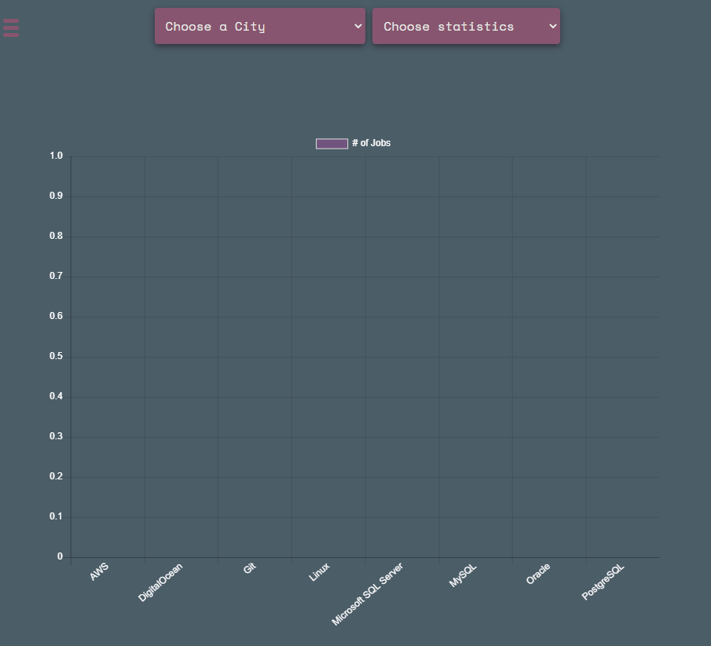

[![Forks][forks-shield]][forks-url]
[![Stargazers][stars-shield]][stars-url]
[](https://github.com/Adam-94/Devstats/blob/master/LICENSE)


<!-- PROJECT LOGO -->
<br />
<p align="center">
  <a href="https://github.com/adam-94/Devstats">
    
  </a>

  <h3 align="center">Devstats</h3>

  <p align="center">
    Statistics for developers looking for jobs. Find 
    what you're city's stats look like!
    <br />
    <a href="https://devstats.co.uk/">View Site</a>
    ·
    <a href="https://github.com/adam-94/Devstats/issues">Report Bug</a>
    ·
    <a href="https://github.com/adam-94/Devstats/issues">Request Feature</a>
  </p>
</p>


## Table of Contents

* [About the Project](#about-the-project)
  * [Data](#data)
  * [Built With](#built-with)
* [Contributing](#contributing)
* [License](#license)


<!-- ABOUT THE PROJECT -->
## About The Project



Devstats is a website for developers looking for statistics on langauges, frameworks and tools. The main focus in mind when developing this was the Job seeking information that would be useful. As a new graduate myself, this data could come in handy with what techologies to learn next. 

## Data

The data is scraped from [Indeed](https://indeed.com) where it goes through each job posting within 30 pages. Then a count is made of each technology that matches. 

Currently the [Script](https://github.com/Adam-94/Devstats/blob/master/scrape.py) goes through 112 cities around the world. Some countries can be diffucult to gather information on, but there will be more added soon. 

If you would like to play around with this just 
1. Clone the repo
```sh
    git clone https://github.com/Adam-94/Devstats.git
```
2. Install requirements.txt
```sh
    pip install -r requirements.txt
```
3. run `scrape.py`
```sh
    python scrape.py
```

### Built With
* [Python](https://www.python.org/)
* [Flask](https://flask.palletsprojects.com/en/1.1.x/)
* [Chart.js](https://www.chartjs.org/)

<!-- LICENSE -->
## License

Distributed under the MIT License. See `LICENSE` for more information.


<!-- MARKDOWN LINKS & IMAGES -->
<!-- https://www.markdownguide.org/basic-syntax/#reference-style-links -->
[forks-shield]: https://img.shields.io/github/forks/adam-94/Devstats.svg?style=flat-square
[forks-url]: https://github.com/adam-94/Devstats/network/members
[stars-shield]: https://img.shields.io/github/stars/adam-94/Devstats.svg?style=flat-square
[stars-url]: https://github.com/adam-94/Devstats/stargazers
[issues-shield]: https://img.shields.io/github/issues/adam-94/Devstats.svg?style=flat-square
[issues-url]: https://github.com/adam-94/Devstats/issues
[product-screenshot]: images/screenshot.png
